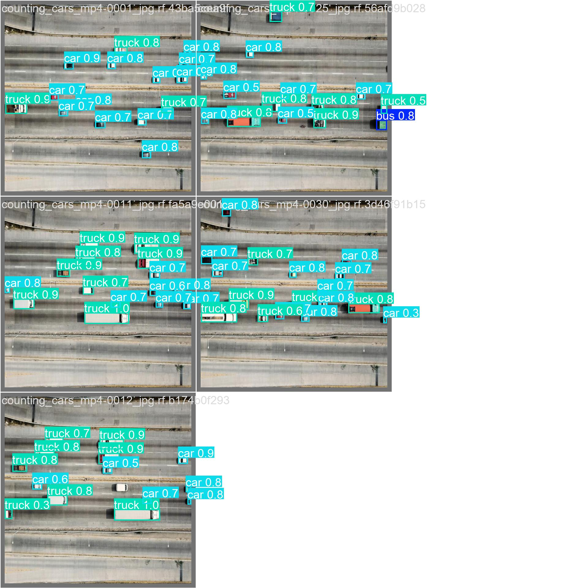
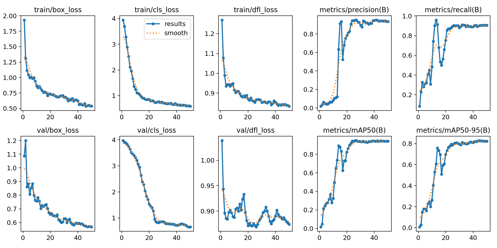
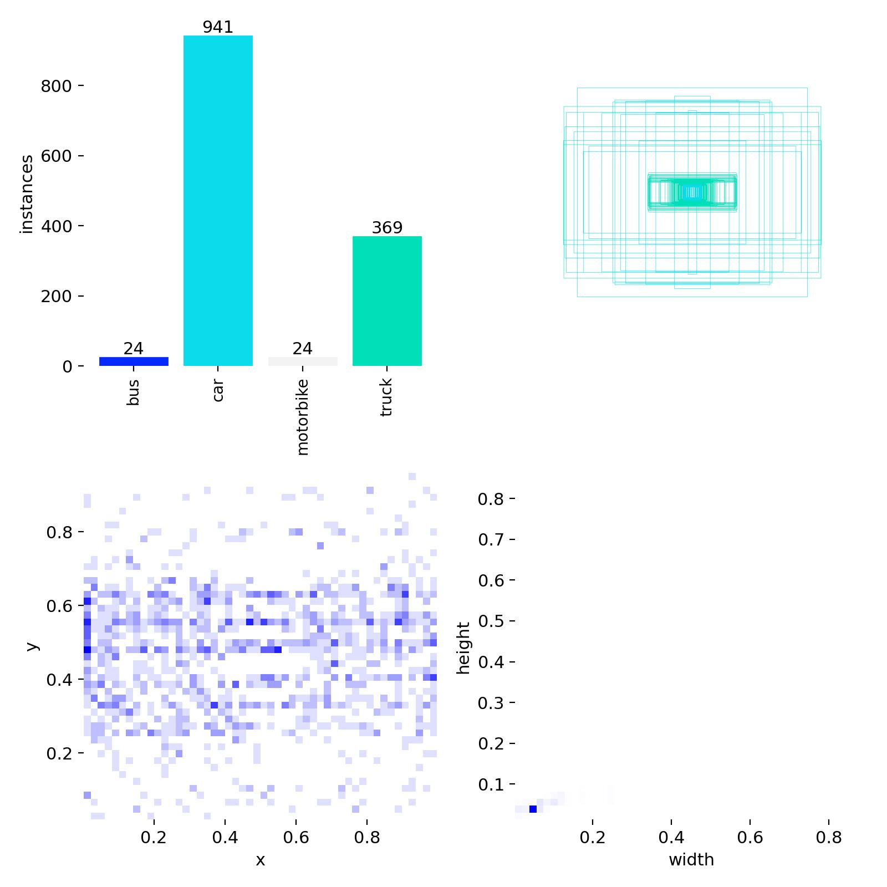
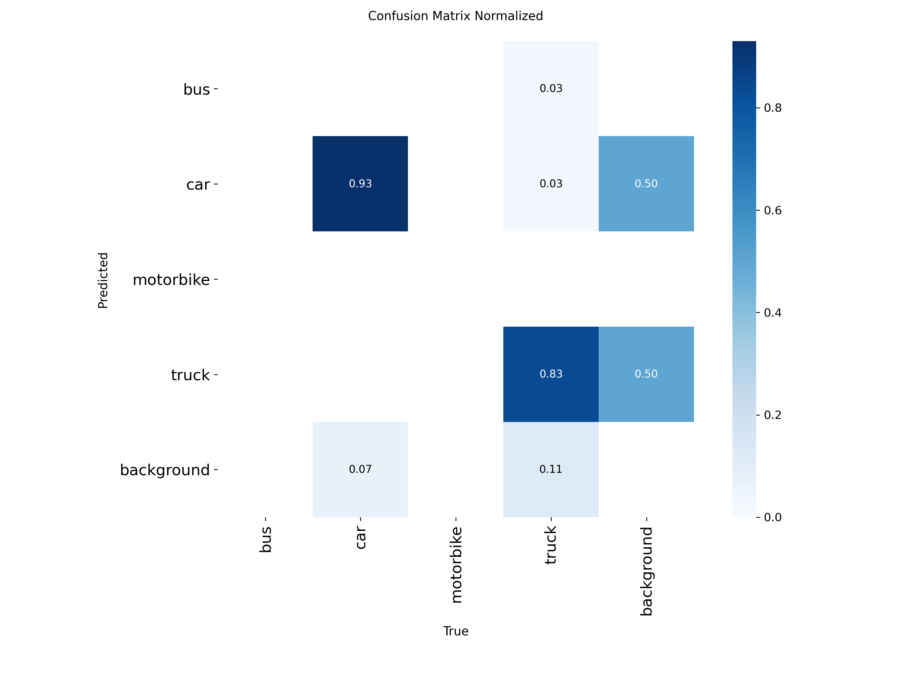

# 🚗 Real-time Traffic Detection using YOLOv11


## 📖 Introduction
This project implements a robust Traffic Detection system capable of identifying and classifying vehicles in real-time. The model is built upon the **YOLOv11** architecture and integrated with **ByteTrack** for stable object tracking across frames.

**Key Features:**
- **Real-time detection** optimized for urban traffic surveillance.
- **Classifies 4 types of vehicles:** `Car`, `Truck`, `Bus`, `Motorbike`.
- **Zone-based Counting:** Counts vehicles entering defined polygon zones.
- **Imbalanced Data Handling:** Analysis of performance across classes with varying sample sizes.

## 🛠️ Tech Stack & Frameworks
This project leverages cutting-edge computer vision libraries and tools:

| Category | Technology | Description |
| :--- | :--- | :--- |
| **Core** |  | Primary programming language. |
| **Detection** |  | State-of-the-art object detection model by Ultralytics. |
| **Tracking** |  | Robust multi-object tracking (MOT) algorithm. |
| **Analytics** |  | Toolkit for filtering detections, zoning, and annotation. |
| **Processing** |  | Image processing and real-time video stream handling. |
| **Data Ops** |  | Efficient array manipulation and numerical computing. |

## 🎥 Demo Result
Check out the model in action (Inference snapshot on validation batch):


*(Note: Bounding boxes show high confidence detection for Cars and Trucks)*

## 📊 Model Evaluation
The model was trained for 50 epochs using SGD optimizer. Below are the specific performance metrics:

### 1. Training Metrics
The model shows excellent convergence with **mAP@50 reaching ~94%** and **mAP@50-95 reaching ~80%**. The loss curves (box, cls, dfl) show a steady decrease, indicating no major overfitting.


### 2. Dataset Distribution
The dataset is heavily weighted towards personal vehicles, which influences class-wise performance:
- **Car:** ~941 instances
- **Truck:** ~369 instances
- **Bus & Motorbike:** ~24 instances each (Minority classes)


### 3. Error Analysis (Confusion Matrix)

- **Strengths:**
    - **Cars:** Achieved **93%** accuracy.
    - **Trucks:** Achieved **83%** accuracy.
- **Limitations:**
    - Performance on `Bus` and `Motorbike` is lower due to extreme data imbalance (only ~2.5% of the dataset).
- **Future Work:** Apply oversampling techniques or collect more heavy-vehicle data to balance the dataset.

## ⚙️ Installation & Usage

1. **Clone the repository:**
   ```bash
   git clone [https://github.com/IBINU0806/Counting_Cars_YOLOv11.git](https://github.com/your-username/Traffic-Detection-YOLOv11.git)
   cd Counting_Cars_YOLOv11
   
2. **Install dependencies:**
    ```bash
   pip install -r requirements.txt
   
3. **Run Inference:**
   ```bash
   python traffic_analysis.py